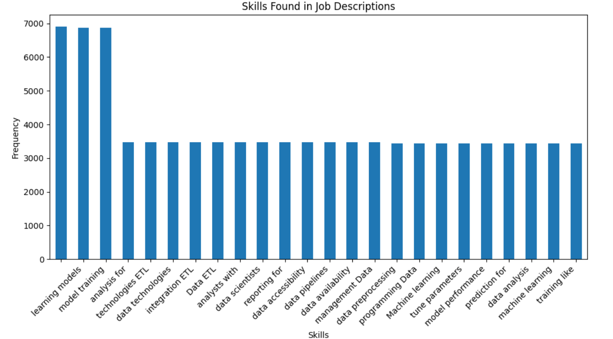
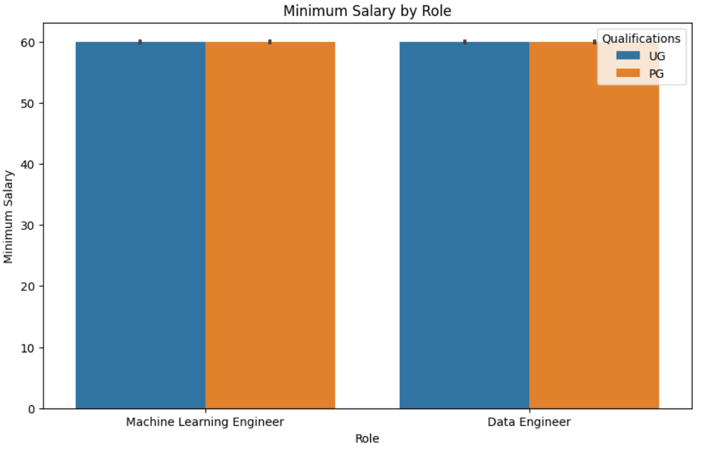
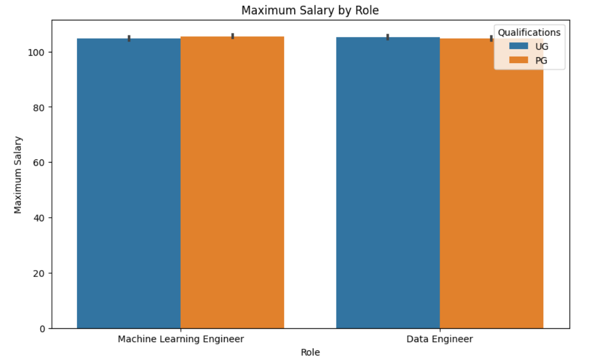
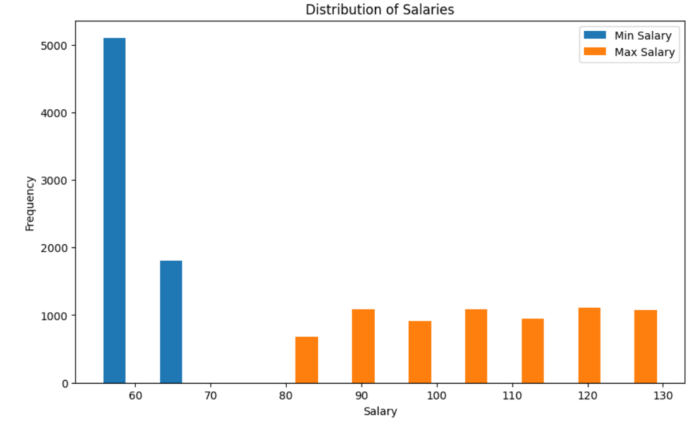
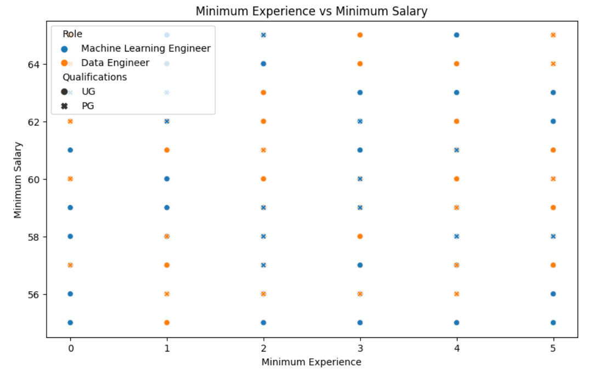
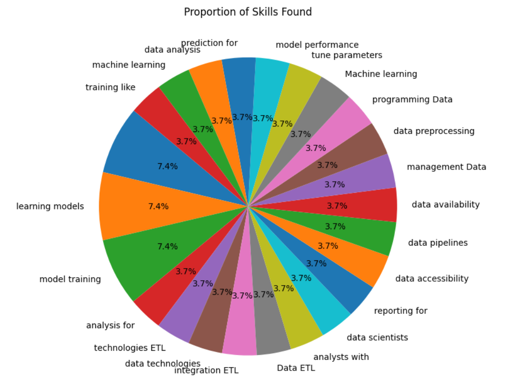
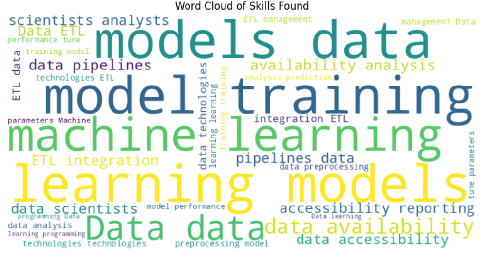
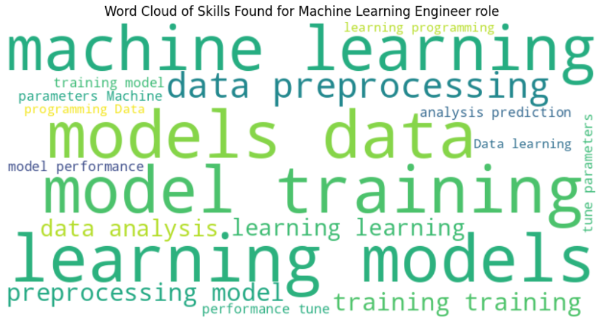
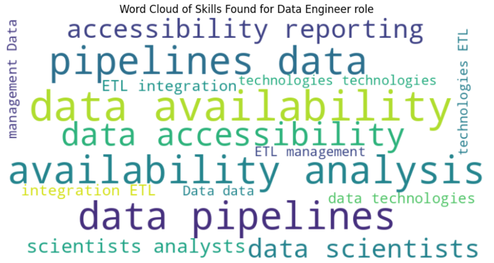

# Data Science Job Market Analysis


## Overview

This project aims to analyze the job market for Data Science roles using exploratory data analysis (EDA) techniques. By examining a dataset containing job listings for various Data Science positions, we seek to gain insights into factors such as salary trends, required qualifications, skills in demand, and more.

## Dataset
[Data Source](https://www.kaggle.com/datasets/ravindrasinghrana/job-description-dataset)

The dataset used for this analysis contains job listings for Data Science roles from diverse locations and companies. It includes information such as job title, experience required, qualifications, salary range, job description, responsibilities, and required skills.

## Analysis Steps

1. **Data Cleaning and Preprocessing**: We started by cleaning and preprocessing the dataset, which involved filtering relevant data, handling duplicates, handling missing values, and transforming certain features such as qualifications and experience.

2. **Extracting Skills**: Using natural language processing (NLP) techniques with the spaCy library, we extracted skills from job descriptions to understand the most sought-after skills in the Data Science job market.

3. **Visualization and Analysis**:
   - Visualized the frequency of skills found in job descriptions using bar plots and word clouds.
   - Analyzed salary trends by role and qualifications using bar plots and scatter plots.
   - Examined the distribution of salaries using histograms.
   - Explored the proportion of skills found in the dataset using a pie chart.

4. **Word Clouds**: Generated word clouds to visually represent the most frequently mentioned skills for the overall dataset, as well as specific roles such as Machine Learning Engineer and Data Engineer.

## Repository Structure

- **Notebooks**: Contains Jupyter Notebooks detailing the data analysis process.
- **Data**: Stores the dataset used for analysis.
- **Images**: Contains images used in the README and notebooks.
- **Requirements.txt**: Lists the required Python packages for reproducing the analysis.

## Plots

### Frequency of Skills Found in Job Descriptions


### Minimum Salary by Role and Qualifications


### Maximum Salary by Role and Qualifications


### Distribution of Salaries


### Minimum Experience vs Minimum Salary


### Proportion of Skills Found


### Word Cloud of Skills Found 


### Word Cloud of Skills Found for Machine Learning Engineer role


### Word Cloud of Skills Found for Data Engineer role


## How to Use

1. Clone the repository:

```bash
git clone https://github.com/Aftabmallick/Data-Science-job-market-eda.git
```

2. Install the required dependencies:

```bash
pip install -r requirements.txt
```

3. Explore the Jupyter Notebooks in the `Notebooks` directory to understand the analysis process and findings.

## Acknowledgments

- The dataset used in this project was obtained from [source](https://www.kaggle.com/datasets/ravindrasinghrana/job-description-dataset)

